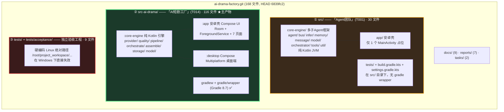
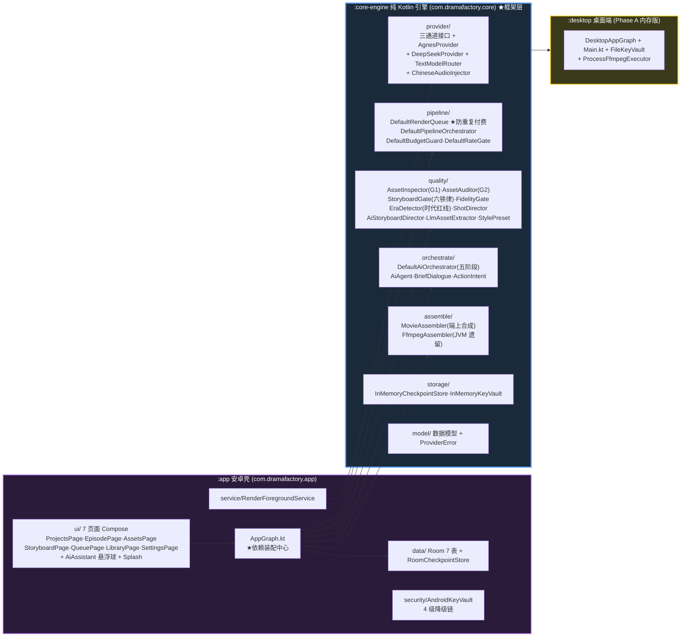
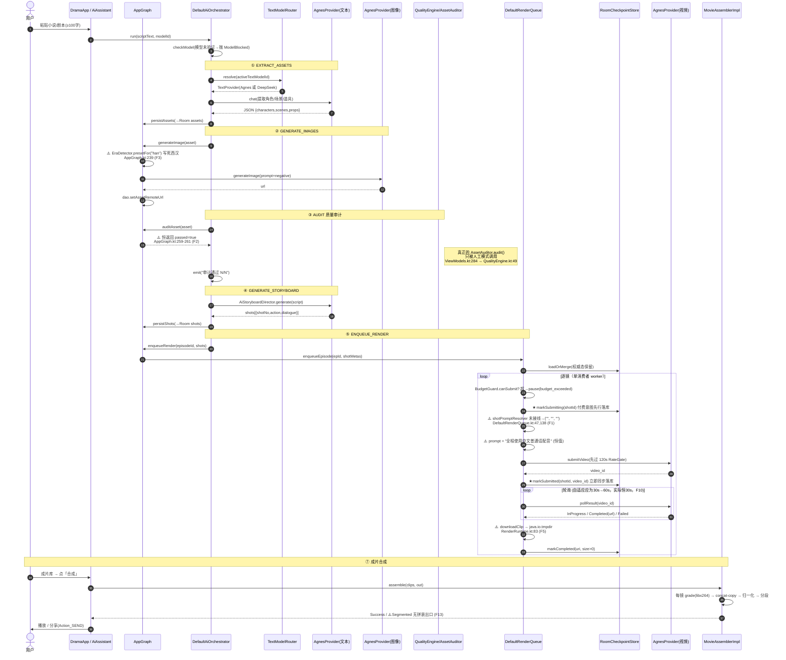
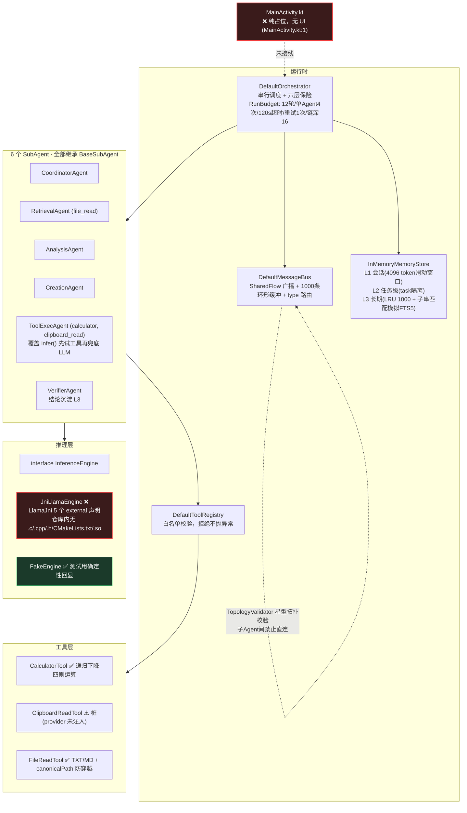

# 「ai-drama-factory」接手评估报告

> 评估人：高见远（软件团队架构师）
> 评估日期：2026-08-28
> 评估方式：**只读静态代码审计**（逐文件读源码，未执行任何构建/测试）
> 评估对象：`C:\Users\owlco\WorkBuddy\2026-08-28-18-36-06\ai-drama-factory`（git HEAD `6839fc2`）
>
> ⚠️ **本报告的证据边界**：本机**无 JDK / 无 Gradle / 无 Android SDK**（已实测 `java`、`gradle` 均 command not found，`ANDROID_HOME` 未设置），
> 因此**无法执行 `./gradlew :app:assembleDebug` 或任何单测**。所有"能否编译/测试是否全绿"的结论均**未验证**，报告中凡属推测一律标注「未验证」。
> 凡带**文件路径 + 行号**的条目，均为我逐行读源码后可以直接复核的硬证据。

---

## 1. TL;DR 一句话结论

> **这是一个"骨架完整、文档漂亮、但核心付费链路上有 6 处 P0 级假完成"的安卓项目——它不是可运行状态，而是一份"看起来跑通了"的半成品。**

拆开说：

| 维度 | 结论 |
|---|---|
| **是不是骨架？** | 不是。UI、Room 持久化、Provider 适配、渲染队列、断点续传、成片合成、桌面端**都写了真代码**，共 168 文件、约 2.4 万行。 |
| **能不能跑起来？** | **未验证**（本机无 JDK/Gradle/Android SDK）。但即使编译通过，**跑出来的片子是错的**——见下方 F1。 |
| **最大问题** | 防重复付费（项目最值钱的部分）写得**非常扎实且经过两轮评审**；但**视频生成的 prompt 恒为空**（F1），等于"花真金白银生成 24 段与剧本无关的随机画面"。 |
| **历史踩坑模式** | 与这个家族过去的病一致：接口/UI/测试都齐了，**关键 λ 回调没接线或返回硬编码常量，流水线仍标记"完成"**。本报告 §4.1 列出 10 条实锤。 |
| **最建议的第一步** | 装 JDK 17 + Android SDK 34 → `./gradlew :app:assembleDebug` 先确认能编译；然后**立刻**修 F1（一行 λ 赋值，30 分钟内可完成），否则后面所有真机验证都是在验证错误行为。 |

**一句话给决策者**：这个项目的"工程骨架"值 70 分，"业务闭环"目前值 20 分——缺的不是大模块，是几处关键接线。

---

## 2. 项目全景

### 2.0 首先要纠正一个认知：这不是"一个项目"，是"一个仓库装了三个互不相干的 Gradle 工程"

这是接手时最容易搞混的点。仓库根目录 `README.md`（1-13 行）自称是"软件开发AI团队共享工作区 project_workspace"，
也就是说**这个仓库是当年那批 AI Agent 的共享硬盘，不是一个软件项目的根目录**。里面躺着：



- **① `src/`（「Agent团队」，T001）**：一个**本地跑 llama.cpp 的离线多子Agent 框架**。纯框架骨架，**永远无法真正推理**（见 F18），且没有任何产品 UI。**已实质放弃**。
- **② `src-ai-drama/`（「AI短剧工厂」，T014）**：**真正的主产物**，也是 GitHub 描述里那个项目。本报告 §3/§4 的重点。
- **③ `tests/`**：两个独立 Gradle 工程，用来做"不改源码的验收测试"，但硬编码了 Linux 绝对路径（F16）。

> **接手建议第一步**：先决定 `src/` 要不要留。它和主产物无任何代码依赖，留着只会让人误判项目范围。

### 2.1 「AI短剧工厂」要解决什么问题

源自 `docs/ai-drama-factory-prd.md:17`：

> 把桌面端 Python 管线 **pavo-drama**（小说→剧本→资产→分镜→视频→成片）移植到安卓手机：**编排逻辑在本地，生成能力走云端 API**。

用户在手机上粘一部小说 → 自动提取角色/场景/道具 → 生成资产图 → 人工评审 → AI 拆分镜 → 逐镜调云端视频模型 → 断点续传地跑完 24 镜 → 端上 ffmpeg 合成竖屏短剧成片。

明确**不做**的（`docs/ai-drama-factory-prd.md:167-177`）：本地大模型推理、iOS/Web、本地剪辑时间线、TTS 声纹克隆、多用户账号。

### 2.2 技术栈与构建方式

全部证据来自 `src-ai-drama/app/build.gradle.kts`、`src-ai-drama/build.gradle.kts`、`src-ai-drama/core-engine/build.gradle.kts`：

| 层 | 选型 | 版本 | 证据 |
|---|---|---|---|
| 语言 | Kotlin | 2.0.21 | `src-ai-drama/build.gradle.kts:3` |
| 构建 | Gradle + AGP | Gradle 8.7 / AGP 8.5.2 | `gradle/wrapper/gradle-wrapper.properties:3`；`build.gradle.kts:7` |
| UI | Jetpack Compose + Material3 | BOM 2024.10.01（compose 1.7.3 / m3 1.3.0） | `app/build.gradle.kts:54-59` |
| 网络 | Ktor Client + OkHttp engine + MockEngine | 2.3.12 | `core-engine/build.gradle.kts:12-19` |
| 序列化 | kotlinx.serialization | 1.7.3 | `core-engine/build.gradle.kts:10` |
| 异步 | Coroutines + Flow | 1.9.0 | `core-engine/build.gradle.kts:9` |
| 本地库 | Room（WAL） | 2.6.1 | `app/build.gradle.kts:73-75` |
| 图片加载 | Coil | 2.6.0 | `app/build.gradle.kts:51` |
| Key 加密 | EncryptedSharedPreferences | security-crypto 1.1.0-alpha06 | `app/build.gradle.kts:78` |
| 视频合成 | ffmpeg-kit（jitpack base 版） | `com.github.arthenica:ffmpeg-kit:5.1` | `app/build.gradle.kts:83` |
| 桌面端 | Compose Multiplatform | 1.6.10 | `build.gradle.kts:9` |
| SDK | minSdk 29 / targetSdk 34 / compileSdk 34 / ndk arm64-v8a | — | `app/build.gradle.kts:12-20` |
| 版本 | versionCode 30 / versionName **1.6.1** | — | `app/build.gradle.kts:17-18` |

**零 Firebase**（`gradle.properties:5` 自述）。

**构建/运行命令**（`src-ai-drama/README.md:69-74`）：

```bash
cd src-ai-drama
./gradlew :app:assembleDebug        # 打 APK
./gradlew test                      # 全量单测
./gradlew :core-engine:test         # 只跑纯 JVM 引擎（最可能在无 SDK 环境跑通）
```

前置要求：JDK 17+，Android SDK 34，**且需要能访问 `jitpack.io`**（`app/build.gradle.kts:37`）解析 ffmpeg-kit。

### 2.3 依赖的第三方服务 / API

全部集中在 `src-ai-drama/core-engine/src/main/kotlin/com/dramafactory/core/provider/`：

| 服务 | 用途 | 端点 | 证据 |
|---|---|---|---|
| **Agnes / PavoAPI**（主） | 文本 + 图像 + 视频三通道 | `https://apihub.agnes-ai.com/v1/` + `/agnesapi?video_id=` | `AgnesProvider.kt:69-70` |
| | 文本 | `POST /chat/completions` | `AgnesProvider.kt:366` |
| | 图像 | `POST /images/generations` | `AgnesProvider.kt:393` |
| | 视频提交 | `POST /videos` | `AgnesProvider.kt:291` |
| | 视频轮询 | `GET /agnesapi?video_id=` | `AgnesProvider.kt:313` |
| | 模型 | `agnes-video-v2.0` / `agnes-2.5-flash` / `agnes-2.0-flash` / `agnes-1.5-flash` / `agnes-image-2.1-flash` | `AgnesProvider.kt:71-73,102-103` |
| **DeepSeek** | 可选文本大脑 | `https://api.deepseek.com/v1`，`deepseek-chat` | `DeepSeekProvider.kt:45-47` |

**Key 全部由用户自带**（`docs/ai-drama-factory-prd.md:175`：不做平台代充值）。运行前必须在「设置」页填 Agnes API Key。

### 2.4 模块划分：哪些是框架，哪些是业务



- **框架层 = `:core-engine`**：不依赖 Android（`core-engine/build.gradle.kts:1` 注释自述），可直接在 JVM 上跑单测，也可上服务端。这是设计得最好的部分。
- **业务/平台层 = `:app`**：Compose UI、Room、ForegroundService、KeyVault、ffmpeg-kit 反射桥。
- **装配中心 = `AppGraph.kt`**：所有 λ 依赖在这里绑到引擎上。**下面 6 处 P0 假完成，有 3 处就在这个文件的 λ 里**（`AppGraph.kt:239`、`:259-261`）。

---

## 3. 核心架构梳理

### 3.1 「AI短剧工厂」分层与关键类清单

| 层 | 关键类 / 接口 | 文件（相对 `src-ai-drama/`） | 状态 |
|---|---|---|---|
| **三通道接口** | `VideoProvider` / `TextProvider` / `ImageProvider` | `core-engine/.../provider/Providers.kt:17,34,40` | ✅ 接口完整，与架构文档签名一致 |
| | `AgnesProvider`（三合一实现） | `core-engine/.../provider/AgnesProvider.kt:50` | ✅ **实现扎实**（限速门/退避/参数归一/Key 掩码全在） |
| | `DeepSeekProvider` | `core-engine/.../provider/DeepSeekProvider.kt:38` | ✅ 实现完整 |
| | `TextModelRouter` / `DefaultTextModelRouter` | `core-engine/.../provider/TextModelRouter.kt:28,51` | ✅ 已实现 |
| **限速门** | `RateGate` / `DefaultRateGate` | `Providers.kt:46` / `pipeline/DefaultRateGate.kt` | ✅ 120s 限速，经 R1/R2 评审逐条核对通过 |
| **渲染队列** | `RenderQueue` / `DefaultRenderQueue` | `Providers.kt:52` / `pipeline/DefaultRenderQueue.kt:35` | ⚠️ **主体扎实，但 prompt 恒空（F1）** |
| **断点续传** | `CheckpointStore` / `RoomCheckpointStore` / `InMemoryCheckpointStore` | `Providers.kt:65` / `app/.../data/RoomCheckpointStore.kt:197` / `core-engine/.../storage/InMemoryCheckpointStore.kt` | ✅ **这是全项目质量最高的部分** |
| **预算闸门** | `BudgetGuard` / `DefaultBudgetGuard` | `Providers.kt:98` / `pipeline/DefaultBudgetGuard.kt` | ✅ CAS 原子化（R2 P1-2 已修） |
| **编排器（七阶段）** | `PipelineOrchestrator` / `DefaultPipelineOrchestrator` | `Providers.kt:107` / `pipeline/DefaultPipelineOrchestrator.kt:15` | ❌ **四闸门恒 true 且从未被调用（F6）** |
| **编排器（AI 五阶段）** | `AiOrchestrator` / `DefaultAiOrchestrator` | `orchestrate/DefaultAiOrchestrator.kt:15,85` | ⚠️ 主流程可跑，但 `retryFrom` 是占位（F4） |
| **质量闸门** | `AssetInspector`（G1 硬校验） | `quality/AssetInspector.kt` | ✅ 纯 Kotlin 实现，无 API 成本 |
| | `AssetAuditor`（G2 多模态） | `quality/AssetAuditor.kt:17,79` | ✅ 实现完整（34 条测试），**但 AI 模式不调用（F2）** |
| | `StoryboardGate`（六铁律） | `quality/StoryboardGate.kt` | ✅ 实现完整 |
| | `FidelityGate`（提交前忠实性） | `quality/FidelityGate.kt` | ✅ 实现完整 |
| | `EraDetector`（时代红线） | `quality/EraDetector.kt:18` | ✅ `detect()` 实现完整，**但 AI 模式不调用（F3）** |
| | `StylePreset`（8 朝代预设） | `quality/StylePreset.kt` | ✅ 汉/唐/宋/明/清/民国/现代/架空 |
| | `LlmAssetExtractor` / `AiStoryboardDirector` / `ShotDirector` | `quality/*.kt` | ✅ 均已实现 |
| **成片合成** | `MovieAssembler` / `MovieAssemblerImpl` | `assemble/MovieAssembler.kt:25,108` | ✅ 三级降级策略，端上实际走这个 |
| | `FfmpegAssembler`（JVM 遗留） | `assemble/FfmpegAssembler.kt:13` | ⚠️ `allSameSpec` 桩失真（F12） |
| | `androidFfmpegKitExecutor()` | `assemble/MovieAssembler.kt:244` | ✅ 反射调用 ffmpeg-kit，缺库时抛 `NotAvailableException` |
| **安全存储** | `KeyVault` / `AndroidKeyVault` | `Providers.kt:118` / `app/.../security/AndroidKeyVault.kt` | ✅ StrongBox→Keystore→明文SP→内存 4 级降级 |
| **后台保活** | `RenderForegroundService` | `app/.../service/RenderForegroundService.kt` | ✅ 已真实接线（dataSync / POST_NOTIFICATIONS / START_STICKY） |
| **持久化** | `DramaDatabase`（Room v5，7 表） | `app/.../data/RoomCheckpointStore.kt:18-28` | ⚠️ 破坏性迁移（F8） |
| **UI** | `DramaApp` 底部 7 项导航 + 开屏动画 | `app/.../ui/DramaApp.kt:50,119` | ✅ 真实实现 |

### 3.2 主流程时序图：从「小说输入」到「成片输出」

下面这张图是**按代码实际执行路径**画的，凡遇到"假完成"的地方我都用 ⚠️ 标出并注明行号。



### 3.3 「Agent团队」（`src/`）多子Agent 架构

这部分是为了完整覆盖 §3 要求，但请注意：**它是一个纯框架骨架，永远无法真正推理**（F18）。



要点：
- **消息模型**（`src/core-engine/.../message/Messages.kt:10-37`）：`AgentMessage{msg_id, from, to, type, payload, timestamp, task_id, reply_to, status}`，9 种 `MessageType`，`TopologyValidator`（:40-54）强制星型拓扑——子Agent 之间禁止直连，`to=user` 仅允许 `FINAL_OUTPUT/ERROR`。
- **编排器六层保险**（`Orchestrator.kt:26-39`）：最大 12 轮、单 Agent 4 次、单节点 120s 超时、失败重试 1 次、reply 链深 >16 判 CANCELLED、总 deadline。另有 Kahn 拓扑排序验环（`Orchestrator.kt:174-193`）。
- **@点名**（`Orchestrator.kt:55-66`）：`@协调/@检索/@分析/@创作/@工具/@校验` 中文名映射。
- **记忆三层**（`MemoryStore.kt:7-20`）：接口设计完整，但**内存实现是唯一实现**，Room 适配器从未落地（`docs/DELIVERY.md:27` 列为遗留 #3）。
- **工具白名单**（`ToolRegistry.kt:16-22`）：`invoke(callerAgentId, toolName, args)` 白名单外返回 `ok=false`，不抛异常——符合 US4 安全要求。

---

## 4. 完成度盘点（最重要）

### 4.1 ⚠️「假完成」实锤清单

> 判定标准：函数体返回硬编码常量 / 占位值 / 空实现，**但流水线（UI 或编排器）仍把它当成功结果继续往下走**。
> 全部条目均已通过全仓库 `grep` 交叉验证过调用点，确保不是"有默认值但生产已覆盖"。

| # | 级别 | 现象 | 位置（文件:行） | 影响 |
|---|---|---|---|---|
| **F1** | 🔴 **P0** | **视频提交 prompt 恒为空。** `shotPromptResolver` 默认值 `{ _ -> Triple("","","") }`，生产代码从未赋值 | `core-engine/.../pipeline/DefaultRenderQueue.kt:47-48`（定义）<br/>同上 `:138-139`（使用）<br/>同上 `:47` 默认值 → `ChineseAudioInjector.kt:35-39` → `:18-24` 的 `inject("")` → **`:20` `if (trimmed.isEmpty()) return MANDARIN_SUFFIX`** | **致命**。全仓库 `shotPromptResolver` 仅 3 处出现：定义、使用、`core-engine/src/test/.../QueueAssemblerTest.kt:51`（测试赋值）。`AppGraph.kt` / `RenderRuntime.kt` / `ViewModels.kt` / `QueueLogic.kt` **均无任何赋值**。⇒ 每一镜提交给 Agnes 的 prompt 恒为 `"全程使用中文普通话配音"`（10 字），**与剧本完全无关**。花真钱出随机画面。 |
| **F2** | 🔴 **P0** | **AI 管线质量审计恒通过。** `auditAsset` λ 直接返回 `passed=true` | `app/src/main/java/com/dramafactory/app/AppGraph.kt:259-261`<br/>（桌面版同样：`desktop/.../DesktopAppGraph.kt:95`） | 真正的 `AssetAuditor.audit()`（`quality/AssetAuditor.kt:79`，369 行、G1+G2 双闸门、`QualityEngineTest` 34 条覆盖）**只被人工模式调用**（`ViewModels.kt:284` → `QualityEngine.kt:49`）。AI 模式下 `DefaultAiOrchestrator.kt:225-236` 的 ③AUDIT 阶段永远打印"审计通过 N/N"。PRD F03 的两层闸门在 AI 模式等于不存在。 |
| **F3** | 🔴 **P0** | **AI 管线时代红线写死「西汉」** | `app/.../AppGraph.kt:239` `EraDetector.presetFor("han")`<br/>（桌面版同样：`DesktopAppGraph.kt:82`） | `EraDetector.detect()`（LLM 自动断代，`quality/EraDetector.kt:30-47`）**只被人工模式调用**（`ViewModels.kt:370-374`）。⇒ AI 模式下现代剧/清宫剧/民国剧的资产图都会被套上西汉服饰约束 + 禁现代物（`EraDetector.kt:86-92` ANCIENT_NEGATIVE）。README 宣称的「🏛 时代红线自动推断」在 AI 模式**不成立**。 |
| **F4** | 🔴 **P0** | **断点续跑 `retryFrom` 用占位剧本** | `core-engine/.../orchestrate/DefaultAiOrchestrator.kt:154-161`<br/>→ `runStages("RETRY_STUB".repeat(10), "default", ...)` | 源码注释自认：「续跑：脚本走占位（由 :app 层接入真实 episode.script_json）」（:158）。⇒ 用户点「从某阶段重试」时，资产提取与分镜生成是对着 100 个 `RETRY_STUB` 跑的，产出全是垃圾，且会消耗真实 token。 |
| **F5** | 🔴 **P0** | **已付费镜头的 clip 下载目录取自 `java.io.tmpdir`，失败后无限重试** | `app/.../ui/RenderRuntime.kt:83` `cacheDir() = System.getProperty("java.io.tmpdir") ?: "/tmp"`<br/>同上 `:68` `File(dir).apply { mkdirs() }` **返回值被丢弃，不校验**<br/>配合 `DefaultRenderQueue.kt:200-203` | 与本项目其他地方一律用 `Context.cacheDir` 的做法不一致（`AppGraph.kt:71`、`AssetsPage.kt:107`、`LibraryPage.kt:82,126`）。若该目录不可写，`f.outputStream()` 抛异常 → 按 P1-4 设计「取回失败保持 SUBMITTED、退避至 60s 上限重试」 ⇒ **已付费镜头既不完结也不失败，永久空转**。（`java.io.tmpdir` 在 ART 上的实际取值**未验证**，需真机打印确认；但"与全项目其余路径策略不一致 + 不检查 mkdirs 结果"这两点是确凿缺陷。） |
| **F6** | 🔴 **P0** | **四闸门恒 true，且从未被调用** | `core-engine/.../pipeline/DefaultPipelineOrchestrator.kt:25-29`<br/>`return GateReport(stage=..., budgetOk=true, keyValid=true, reviewPassed=true, storyboardPassed=true)` | 全仓库 `evaluateGates` 仅 3 处：接口声明（`Providers.kt:111`）、该实现、无生产调用点。⇒ PRD §4.1 的「七阶段进入门槛」在引擎层**完全不存在**。注意：UI 层确实自己实现了评审闸门（`AssetsPage` 的 keep/regen 全过才点亮「去渲染」），所以未造成实际损失，但这是"文档说的机制"与"代码里的机制"两回事。 |
| **F7** | 🟠 P1 | **桌面版成片闭环是假的**：渲染任务直接标 COMPLETED 并写 0 字节文件 | `desktop/.../DesktopAppGraph.kt:107-108`（标 COMPLETED + `mockClip`）<br/>同上 `:122-127` `mockClip` → `f.writeBytes(ByteArray(0))`<br/>同上 `:114-117` `persistAssets/persistShots/writeCheckpoint` 全空实现 | 0 字节 clip 传进 `MovieAssemblerImpl.assemble`（`MovieAssembler.kt:130` `require(it.exists() && it.length() > 0)`）→ 抛 `IllegalArgumentException` → `composeFilmIfReady:139` 的 `runCatching` 吞掉 → **永远返回 null**。桌面端 UI 上的「🎬 成品成片已生成」在当前代码下不可能出现。 |
| **F8** | 🟠 P1 | **Room 所有 Migration 对象是死代码 + 全局破坏性迁移** | `app/.../data/RoomCheckpointStore.kt:18-27`（`@Database version=5`，7 张表）<br/>同上 `:39-49`（`fallbackToDestructiveMigration()`，**无 `addMigrations()`**）<br/>死代码：`:52` MIGRATION_1_2、`:67` MIGRATION_3_4、`:75` MIGRATION_2_3、`:95` MIGRATION_4_5 | 全仓库 `grep addMigrations` **零命中**。⇒ 4 个 Migration 对象定义了但从未注册，数据库名还从 `drama_factory.db` 改成 `drama_factory_v2.db`（commit `2d16f5d`）来绕过迁移。任何 schema 变更 ⇒ **用户数据全量清空**。注释里承认「本地库数据本就未落盘」——这恰恰说明当时落盘是有问题的。 |
| **F9** | 🟠 P1 | **`AiPipelinePage.kt`（770 行）已成孤儿代码** | `app/.../ui/AiPipelinePage.kt:400`（自身定义） | 全仓库 `grep AiPipelinePage` **仅命中自身定义 1 处，无任何调用点**。是 v1.6.0（commit `3067a95`「取消AI模式+全局悬浮球AI助手」）重构后的遗留物。`DramaApp.kt:173-196` 的路由表中没有它。 |
| **F10** | 🟠 P1 | **轮询自适应间隔未接线 + 相关函数成死代码** | `core-engine/.../provider/AgnesProvider.kt:330-331` `adaptivePollInterval()` **定义后无任何调用**<br/>`DefaultRenderQueue.kt:43-45` `pollIntervalMs` 默认恒定 `30_000L` | 全仓库 `pollIntervalMs =` 只出现在测试里（`Round2FixRegressionTest.kt` 8 处、`QueueAssemblerTest.kt:75`、`E2eSmokeTest.kt:50`，均注入 `{ 0 }`）。⇒ 架构 §7.1 / PRD F09 承诺的「submitted 初期 30s，10 分钟后降为 60s」**未落实**，恒定 30s，后台 8 小时轮询流量会比 PRD 指标（≤5MB）高一倍。 |

**未修复的历史登记项**（交叉验证 `reports/` 中的审查报告）：

| 来源 | 编号 | 问题 | 现状 |
|---|---|---|---|
| `reports/ai-drama-review-r2.md:50-51` | **N-3** | `pollResult` 返回 completed 但 url 为空 → 下载无限退避，建议空 url 视为 Failed 或设取回上限 | ❌ **未修**。`AgnesProvider.kt:317-319` 仍 `?: ""` 后返回 `PollResult.Completed("")`；`DefaultRenderQueue.kt:193-203` 重试仍无次数上限 |
| `reports/ai-drama-review-r2.md:44-45` | N-1 | `budgetConfirmed` 一次性放行位滞留窗口 | ❌ 未修（`DefaultRenderQueue.kt:62,129,226` 语义未收紧） |
| `reports/ai-drama-review-r1.md:64` | P2-1 | `FfmpegAssembler.allSameSpec` 桩失真（只要非空就判同规格） | ❌ **未修**。`FfmpegAssembler.kt:79` 仍 `clips.all { it.length() > 0 }` |
| `reports/ai-drama-review-r1.md:65` | P2-2 | ffmpeg 执行无超时，`waitFor()` 可永久挂起 | ❌ 未修（`FfmpegAssembler.kt:138`）。缓解：端上实际用的 `MovieAssemblerImpl` 走 ffmpeg-kit 反射通道，异步路径有 30 分钟 latch（`MovieAssembler.kt:271`），同步路径无超时 |
| `reports/ai-drama-review-r1.md:47-48` | N-2 | RECONCILE 无出口，钱可能永久悬置 | ✅ **已修**。`ViewModels.kt:68-77` 接了 `onReconcileResolve`（重试→PENDING / 放弃→BLOCKED），UI 有对话框 |
| `docs/AI-DRAMA-DELIVERY.md:27` | 遗留 #1 | Room 版 CheckpointStore 未接 | ✅ **已修**。`AppGraph.kt:158` `checkpointStore = RoomCheckpointStore(dao)` |
| `docs/AI-DRAMA-DELIVERY.md:31` | 遗留 #4 | 小说导入/资产生成/评审三环为桩 | ✅ **已实现**（`ProjectsPage.kt` / `AssetsPage.kt` + `AssetsLogic.kt`） |

> 结论：R1 打回的 P0×2、P1×6 **确已全部修复**（我逐条核对了代码行号），R2 的 4 项条件中 #1/*#3 已完成、**N-1 与 N-3 未做**。
> 这批"假完成"不是旧问题的残留，而是 **v1.4~v1.6 迭代期间新增的接线遗漏**——项目后期追求"AI 全托管一键出片"的演示效果，把质量闸门绕过去了。

### 4.2 逐模块完成度矩阵

| 模块 | 完成度 | 说明 |
|---|---|---|
| **Provider 三通道（Agnes）** | ✅ **已实现（质量高）** | 120s 限速门、429 专用长退避（30s→180s×3）、5xx 指数退避、401 零重试、num_frames 归一 8n+1≤441、尺寸 64 倍数、keyframes 双帧带 mode、中文配音注入、Key 掩码前3后3、响应体截断脱敏 —— 全部在 `AgnesProvider.kt` 中，逐条对齐 pavo agnes_client.py |
| **Provider（DeepSeek）** | ✅ 已实现 | `DeepSeekProvider.kt` |
| **TextModelRouter** | ✅ 已实现 | Agnes/DeepSeek 双候选，Key 分池 |
| **防重复付费状态机** | ✅ **已实现（全项目最扎实）** | SUBMITTING 意图先行落库 → video_id 到手第一动作 markSubmitted → RECONCILE 待对账绝不盲重提 → 恢复时 pendingRepoll 优先。经 R1 打回、R2 逐行复核，且有 `E2eSmokeTest.kt:92-93`「27 镜恰 27 次唯一提交」的断言 |
| **渲染队列** | ⚠️ **半成品** | 状态机/预算/暂停/取消/单消费者 join 全对；**但 prompt 恒空（F1）** |
| **断点续传（Room）** | ✅ 已实现 | `RoomCheckpointStore.kt` load-or-merge、Mutex 保护、size>0 校验、allEpisodeIds 全量扫描 |
| **预算闸门** | ✅ 已实现 | CAS 原子扣减、超限暂停、用户确认后一次性放行 |
| **编排器（AI 五阶段）** | ⚠️ **半成品** | 正向流程可跑，进度流真实；`retryFrom` 占位（F4）、AUDIT 恒过（F2）、era 写死（F3） |
| **编排器（七阶段 Gate）** | ❌ **空壳** | `evaluateGates` 恒 true 且无调用（F6） |
| **质量闸门 G1（文件硬校验）** | ✅ 已实现 | `AssetInspector.kt` 纯 Kotlin，0 API 成本 |
| **质量闸门 G2（多模态）** | ✅ 已实现但**未接入 AI 管线** | `AssetAuditor.kt` 完整；仅人工模式调用（F2） |
| **六铁律 / 忠实性闸门** | ✅ 已实现 | `StoryboardGate.kt` / `FidelityGate.kt` |
| **时代红线** | ⚠️ 半成品 | `EraDetector.detect()` 完整；AI 模式写死（F3） |
| **角色 DNA 6 姿态** | ✅ 已实现 | `AssetsLogic.buildPosePack` + `StylePreset.characterPoses` |
| **成片合成** | ⚠️ **半成品** | 三级策略完整，但分段导出无出口（F13）、端上分级硬编码 libx264（F20）、`FfmpegAssembler.allSameSpec` 失真（F12）。**真机可用性未验证** |
| **Compose UI（7 页）** | ✅ **已实现** | 项目/剧集/资产/分镜/渲染/成片/设置 + 开屏动画 + 全局 AI 悬浮球。非占位 |
| **Room 持久化** | ⚠️ 已实现但有隐患 | 7 表 + RoomCheckpointStore，但破坏性迁移（F8） |
| **Key 安全存储** | ✅ 已实现 | StrongBox→Keystore→明文SP→内存 4 级降级，永不抛异常 |
| **后台保活 FGS** | ✅ 已实现 | dataSync 类型、POST_NOTIFICATIONS 动态申请、notify 包 runCatching、START_STICKY |
| **崩溃兜底** | ✅ **已实现（超出预期）** | `AppGraph.CrashLog`（:408-448）全局未捕获异常 → `files/crash/last_crash.txt` + `/sdcard/Download/ai-drama-crash.log` |
| **桌面端** | ❌ **演示级空壳** | 内存存储、0 字节 mock clip（F7）、persist 全空 |
| **`src/`「Agent团队」** | ❌ **框架骨架，无法运行** | 无 llama.cpp native（F18）、无 UI（F19 相关）、无 Room 适配器 |
| **测试** | ⚠️ 数量足但**未验证** | 静态统计 **231 个 `@Test`**（29 个测试文件：`src/` 22 + `src-ai-drama/core-engine` 136 + `src-ai-drama/app` 67 + desktop 1 + tests 5）。**本机无 JDK，一个都没跑过** |

### 4.3 tasks/ 任务卡片编号核查

这是你特别要求核实的一点，结论如下：

| 卡片 | 内容 | 对应工程 |
|---|---|---|
| `tasks/T001-需求.md` | 「**Agent团队**」原始需求（本地 llama.cpp + 5 个子Agent + 消息总线 + 团队面板 UI） | `src/` |
| `tasks/T014-AI模式与成片合成.md` | 「**AI短剧工厂**」的 T014（首页双模式 + DeepSeek 接入 + 成片合成） | `src-ai-drama/` |

**回答你的问题：T002~T013 是"同一编号体系下的中间卡片，但没有随仓库提交"，不是另一套编号系统。**

证据链：
1. **编号体系是同一套**：`README.md:12-13` 说明这是共享工作区，`tasks/` 是"模式B的消息介质"，总指挥统一写卡片。T001 属 A 项目、T014 属 B 项目，说明流水号跨项目连续递增。
2. **T014 自证存在上游**：`tasks/T014-AI模式与成片合成.md:5` 写「v1.3.0 已有：项目/剧集管理、AI资产提取、AI分镜、渲染队列」——说明 T014 之前有若干张卡片产出了 v1.2.0/v1.3.0，但这些卡片不在仓库里。
3. **T014 有配套子文档**：`src-ai-drama/docs/T014-prd.md`、`T014-arch.md`、`T014-decisions.md` 都在，唯独主卡片的上游兄弟不在。
4. **docs/ 里没有完整任务清单**：我通读了 `docs/` 全部 9 个文件（prd/architecture/decisions/DELIVERY/ai-drama-factory-×3/racknerd-reply），**没有任何一处列出 T001~T014 的完整清单或状态表**。
5. **git log 反推的工作量远大于 2 张卡片**：30 次提交、v1.2.0→v1.6.1、十三个"轮次"（源码注释里出现"第六轮/第九轮/第十轮/第十一轮/第十三轮"），显然对应十几张任务卡片。

⇒ **结论：T002~T013 共 12 张卡片丢失（或从未落盘到这个仓库）。你手上的任务历史是断的，无法从卡片反推"哪些需求做过、哪些没做"。**
⇒ **替代办法**：`git log --oneline`（30 条，信息密度很高）+ 源码注释中的"轮次"标记，是目前唯一可追溯的迭代史。我在 §7 路线图里基于此给建议。

---

## 5. 文档 vs 代码一致性检查

### 5.1 文档写了但代码没实现

| # | 文档声称 | 位置 | 代码实际情况 |
|---|---|---|---|
| D1 | 轮询间隔自适应「submitted 初期 30s，10 分钟后降 60s」 | `docs/ai-drama-factory-architecture.md:352`；`docs/ai-drama-factory-prd.md:128` | ❌ 恒定 30s。`AgnesProvider.kt:330` 的 `adaptivePollInterval()` 是死代码，`DefaultRenderQueue.kt:43` 默认 30s 且生产未覆盖（F10） |
| D2 | 「任何 error 阻断渲染」「评审全过才放行」由 `PipelineOrchestrator.evaluateGates` 判定 | `docs/ai-drama-factory-architecture.md:206`；`docs/ai-drama-factory-prd.md:101-102` | ❌ `DefaultPipelineOrchestrator.kt:25-29` 恒 true 且无调用点（F6）。UI 层自己实现了评审门，但不是同一个机制 |
| D3 | 「被闸门拦下时点击进度条直达拦截详情」 | `docs/ai-drama-factory-prd.md:105` | ❌ 未实现。`DramaApp.kt:151-165` 是纯 7 项导航，无阶段进度条 |
| D4 | FFmpegKit 依赖为 `com.arthenica:ffmpeg-kit-full-gpl:6.0-2.LTS` | `docs/ai-drama-factory-architecture.md:57` | ❌ 实际是 `com.github.arthenica:ffmpeg-kit:5.1`（jitpack base 版），`app/build.gradle.kts:83` |
| D5 | 「七阶段顶部常驻进度条」 | `docs/ai-drama-factory-prd.md:105` | ❌ 未实现（同 D3） |
| D6 | 成片合成降级路径「提示用户云端组装，预留接口 `Assembler.local()/cloud()`」 | `docs/ai-drama-factory-architecture.md:61` | ❌ 无 `cloud()` 实现，分段产物直接报"暂未支持拼装"（F13） |
| D7 | 「Key 由 KeyVault 按 configId 取得」 | `docs/ai-drama-factory-architecture.md:126` | ⚠️ 实现更宽松：`AppGraph.kt:168-172` 按 4 个候选 configId 依次取第一个非空（这是为修 bug 打的补丁，比文档描述的更健壮，但与文档不一致） |
| D8 | 数据库 6 张表 | `docs/ai-drama-factory-architecture.md:243-319`；`DramaDatabase.kt:12` 注释仍写"Room实体×6" | ⚠️ 实际 **7 张**（多了 `finished_films`），`RoomCheckpointStore.kt:19-24`。文件头注释未同步更新 |
| D9 | README badge：version **1.4.0**、platform **Android 8.0+**、minSdk **26** | `src-ai-drama/README.md:3` | ❌ 实际 `app/build.gradle.kts:15-18`：minSdk **29**、versionCode 30、versionName **1.6.1**。**README 落后 3 个大版本**（1.4.0 vs 1.6.1） |
| D10 | README 宣称「🛡 QualityEngine 质量闸门 G1+G2，缺陷直接拒」 | `src-ai-drama/README.md:26` | ⚠️ 人工模式成立，AI 模式恒过（F2） |
| D11 | README 宣称「🏛 时代红线自动推断，AI 判断剧本朝代」 | `src-ai-drama/README.md:29` | ⚠️ 人工模式成立，AI 模式写死西汉（F3） |
| D12 | README 路线图把「C 端云服务（Ktor 后端）」列为待办 | `src-ai-drama/README.md:81` | — 未实现，属预期内 |

### 5.2 代码有但文档没提

| # | 代码事实 | 位置 | 文档覆盖 |
|---|---|---|---|
| C1 | **桌面端 `:desktop` 模块**（Compose Multiplatform，Phase A） | `src-ai-drama/desktop/` | ❌ `docs/` 与 `src-ai-drama/docs/T014-*.md` **完全没提**。只在 git commit `396b9fe` 里出现 |
| C2 | **全局 AI 悬浮球助手**（`AiAssistant.kt` 335 行 + `ActionIntent.kt`），v1.6.0 取消了「AI 模式」改为悬浮球 | `app/.../ui/AiAssistant.kt`、`DramaApp.kt:214` | ❌ 所有文档都还停留在 T014 的"首页双模式"设计。T014 的交付形态已被推翻，但 T014 文档未更新 |
| C3 | 开屏动画（2.6s 五瓣花 + 三行文案） | `DramaApp.kt:62-116` | ❌ 无文档 |
| C4 | 崩溃日志落 `/sdcard/Download/ai-drama-crash.log` | `AppGraph.kt:421-427` | ❌ 无文档。**隐私/合规提示**：把崩溃栈写到公共下载目录，建议后续评估是否保留 |
| C5 | DB 名改为 `drama_factory_v2.db` + 全局破坏性迁移 | `RoomCheckpointStore.kt:39,49` | ❌ 无文档，只在 commit `2d16f5d`/`798a147` 中 |
| C6 | `AgnesProvider` 的 token 熔断（≥230K tokens 直接抛 ValidationError 不发请求） | `AgnesProvider.kt:74-101` | ❌ 架构/PRD 均未提，是第 10 轮补的 |
| C7 | 资产缩略图用 Coil 加载（第八轮） | `app/build.gradle.kts:51`；`AssetsPage.kt:643-672` | ❌ 文档未提（`reports/issues.md:23` 曾列为遗留，已修） |

### 5.3 文档内部自相矛盾

| # | 矛盾 | 位置 |
|---|---|---|
| M1 | **同名文件两份，内容完全不同**：`reports/ai-drama-dev-report.md`（139 行，第一~五轮，59 测试）vs `src-ai-drama/reports/ai-drama-dev-report.md`（29 行，仅第九轮，128 测试）。`diff` 显示二者仅第 2-4 行重合 | 两文件对比 |
| M2 | 交付清单说「36 用例全过」、第九轮报告说「128 例全绿」、静态统计现在是 231 个 `@Test`。三个数字口径不同（验收时点不同 + 三个独立工程混算），**但没有任何文档说明口径** | `docs/AI-DRAMA-DELIVERY.md:19` vs `src-ai-drama/reports/ai-drama-dev-report.md:27` vs 现状 |
| M3 | `docs/AI-DRAMA-DELIVERY.md:18` 说开发 Agent「✅ 35测试全绿」，`:19` 说测试 Agent「✅ 36用例全过」——差 1 例未说明 | 同上 |
| M4 | T014 任务卡要求「versionCode+1 / versionName **1.4.0**」（`tasks/T014-AI模式与成片合成.md:38`），实际已到 1.6.1 | 卡片 vs 代码 |
| M5 | PRD §8 Q5 决议「冒烟测试 FFmpegKit 端侧拼接 24 镜」，架构 §9 列为验收锚点；`docs/AI-DRAMA-DELIVERY.md:32` 列为遗留 #6「未做」。**真机基准从未执行** | 多份文档 + 无对应测试报告 |

### 5.4 文档与仓库定位的错位（结构性）

| # | 事实 |
|---|---|
| S1 | 根 `README.md` 描述的是「共享工作区 project_workspace」，**不是**这个 App 的 README。GitHub 仓库首页显示的是工作区说明，会让任何新访客（包括未来的你）误判项目性质。 |
| S2 | `docs/racknerd-reply.md` 是一封 **RackNerd VPS 滥用申诉邮件草稿**（UCEPROTECT-Level1 黑名单、IP `107.173.70.115`、Debian 12 重装请求），与本项目**毫无关系**，是共享工作区里的无关残留。建议删除或移出。 |
| S3 | `docs/` 下混装两个项目的文档：`prd.md`/`architecture.md`/`decisions.md`/`DELIVERY.md` 属「Agent团队」；`ai-drama-factory-*.md`/`AI-DRAMA-DELIVERY.md` 属「AI短剧工厂」。**无分隔、无索引**。 |

---

## 6. 技术债与风险清单

### 🔴 P0（阻塞：不修就不能真机验收）

| ID | 风险 | 位置 | 影响 | 修复成本 |
|---|---|---|---|---|
| **P0-1** | 视频 prompt 恒为空 | `DefaultRenderQueue.kt:47,138` + 生产未接线 | **所有出片与剧本无关，钱白花**。这是接手后必须第一个处理的 | **极低**：在 `AppGraph.init` 或 `RenderRuntime.queueFor` 里给 `shotPromptResolver` 赋一个从 `shots` 表读 `dialogue/narration/action` 的 λ，30 分钟内可完成 |
| **P0-2** | AI 模式质量审计恒过 | `AppGraph.kt:259-261` | 缺陷资产直接进入渲染，浪费视频额度；PRD F03 落空 | **低**：把 λ 换成调用 `QualityEngine().auditAsset(...)`（`ViewModels.kt:284` 已有现成写法，抄过来即可） |
| **P0-3** | AI 模式时代红线写死西汉 | `AppGraph.kt:239` | 非汉代剧本全部被错误约束 | **低**：改为 `EraDetector.detect(script, llmReady){...}.eraKey`，`ViewModels.kt:370-374` 有现成写法 |
| **P0-4** | `retryFrom` 用占位剧本 | `DefaultAiOrchestrator.kt:154-161` | 重试路径产出垃圾 + 烧 token | **中**：需要把 `episode.script_json` 读出来传进去（AppGraph 侧加一个 `readScript` λ） |
| **P0-5** | clip 下载目录用 `java.io.tmpdir` | `RenderRuntime.kt:68,83` | 已付费镜头可能永久空转（不完成也不失败），钱花了片拿不到 | **低**：改用 `AppGraph.appContext()?.cacheDir`，并给取回重试加次数上限 |
| **P0-6** | 四闸门恒 true 且无调用 | `DefaultPipelineOrchestrator.kt:25-29` | 引擎层无 Gate 概念；未来任何依赖它的新功能都会 silently 放行 | **中**：要么真实实现（从 Room 读 `review_state`/`sb_check`/`provider_configs.is_verified`/预算），要么显式 `TODO()`+文档标注，别留"假通过" |

### 🟠 P1（重要：影响可用性或数据资产）

| ID | 风险 | 位置 | 影响 | 修复成本 |
|---|---|---|---|---|
| P1-1 | 破坏性迁移 + 4 个 Migration 死代码 | `RoomCheckpointStore.kt:39-49,52,67,75,95` | schema 一变用户数据全清；`render_tasks` 里的 video_id 丢了 ⇒ **直接破坏防重复付费** | 中：注册 `addMigrations()` 并逐个验证迁移 SQL 与 Entity 一致 |
| P1-2 | 桌面端成片闭环是假的（0 字节 mock clip） | `DesktopAppGraph.kt:107-127` | 桌面端演示必然失败 | 中：要么接真 Agnes 视频端点，要么明确标注"Phase A 不可演示" |
| P1-3 | `pollResult` completed 但 url 空 → 无限退避（R2 N-3） | `AgnesProvider.kt:317-319` + `DefaultRenderQueue.kt:193-203` | 已付费镜头永久空转 | 低：空 url 视为 Failed 或加取回次数上限 |
| P1-4 | `AiPipelinePage.kt` 770 行孤儿代码 | `ui/AiPipelinePage.kt:400` | 误导读者、增加维护面 | 极低：删除 |
| P1-5 | 端上色彩分级硬编码 `libx264`，但依赖是 ffmpeg-kit **base** 版 | `MovieAssembler.kt:147` vs `app/build.gradle.kts:83` | base 版不含 GPL 编码器 ⇒ 分级必失败（会降级用原片，不阻断，但"色彩统一"特性等于没做） | 中：换 full-gpl 或改用 mediacodec / 去掉分级 |
| P1-6 | ffmpeg-kit 依赖来源可疑且上游已归档 | `app/build.gradle.kts:35-37,83` | **未验证** `com.github.arthenica:ffmpeg-kit:5.1` 能否从 jitpack 解析。若解析失败 ⇒ `:app:assembleDebug` 直接失败 | 未知，需首次构建确认。ffmpeg-kit 项目 2024 年已停止维护 |
| P1-7 | 轮询恒定 30s，非自适应（R2/PRD 承诺未落实） | `DefaultRenderQueue.kt:43`；`AgnesProvider.kt:330` 死代码 | 后台 8 小时轮询流量约为 PRD 指标（≤5MB）的 2 倍 | 低：接线即可 |
| P1-8 | `FfmpegAssembler.allSameSpec` 桩失真（R1 P2-1 未修） | `FfmpegAssembler.kt:79` | 混合分辨率走 concat-copy ⇒ 花屏/时长错乱 | 低（该文件端上已不用，可只降级为 JVM 测试用途） |
| P1-9 | `src/`「Agent团队」无 llama.cpp native，永远无法推理 | `infer/InferenceEngine.kt:19-25,36-43` | 该工程是死资产 | 决策项：删或冻结标注 |

### 🟡 P2（改进 /  hygiene）

| ID | 风险 | 位置 |
|---|---|---|
| P2-1 | 分段导出（Segmented）无拼装出口，直接报"暂未支持拼装" | `LibraryPage.kt:148-150`；`AppGraph.kt:74-91` 只处理 Success |
| P2-2 | README 版本/平台声明与 build.gradle 不一致（1.4.0/API26 vs 1.6.1/API29） | `src-ai-drama/README.md:3` vs `app/build.gradle.kts:15-18` |
| P2-3 | `src/app/build.gradle.kts:24` `composeOptions.kotlinCompilerExtensionVersion="1.5.15"` 与 Kotlin 2.0.21 + `org.jetbrains.kotlin.plugin.compose` 并存 | 可能触发告警甚至构建失败，**未验证** |
| P2-4 | `src/` 工程无 gradle wrapper（wrapper 只在 `src-ai-drama/`），需系统 gradle 才能构建 | `src/` 目录下无 `gradlew`/`gradle/` |
| P2-5 | 顶层 `tests/` 硬编码 Linux 绝对路径，Windows 下直接失效 | `tests/acceptance/build.gradle.kts:6`；`tests/acceptance/cp.txt:1` |
| P2-6 | 仓库混入无关文件（RackNerd 申诉邮件） | `docs/racknerd-reply.md` |
| P2-7 | 桌面端 CMP 1.6.10 与 app 端 androidx Compose 1.7.3 版本错配 | `build.gradle.kts:9` vs `app/build.gradle.kts:54` |
| P2-8 | `budgetConfirmed` 一次性放行位滞留窗口（R2 N-1） | `DefaultRenderQueue.kt:62,129,226` |
| P2-9 | 崩溃栈写入公共下载目录 `/sdcard/Download/ai-drama-crash.log`，可能含敏感信息 | `AppGraph.kt:421-427` |
| P2-10 | 无 CI 配置（无 `.github/workflows`），"全绿"全靠人工声称 | 仓库根 |
| P2-11 | 三份文档口径不一（36/128/231 测试），无统一说明 | 见 §5.3 M2 |

---

## 7. 接手路线图

分三个阶段。**核心原则：先证明能编译，再修致命接线，最后才谈功能迭代**——否则你会在错误行为上做优化。

### 阶段 0：把环境跑起来（0.5 ~ 1 天）

| 动作 | 具体步骤 | 验收标准 |
|---|---|---|
| 0.1 装工具链 | JDK 17 + Android SDK 34 + 设置 `ANDROID_HOME`；在 `src-ai-drama/` 下建 `local.properties`（已在 `.gitignore` 中，安全） | `java -version` 输出 17；`sdkmanager --list` 可见 android-34 |
| 0.2 先跑纯 JVM 引擎 | `cd src-ai-drama && ./gradlew :core-engine:test` | 136 条测试状态揭晓。**这是风险最低的第一步**——不依赖 Android SDK |
| 0.3 再跑 app 单测 | `./gradlew :app:testDebugUnitTest` | 67 条状态揭晓 |
| 0.4 最后打 APK | `./gradlew :app:assembleDebug` | 出 APK。**重点关注 jitpack 能否解析 ffmpeg-kit:5.1（P1-6）和 composeOptions 冲突（P2-3）** |
| 0.5 记录真相 | 把三条命令的真实输出贴进 `docs/`（例如 `docs/BUILD-STATUS.md`） | 从此不再有"声称全绿" |

> ⚠️ **不要跳过 0.5**。这个项目历史上最大的问题就是"声称"与"事实"之间没有可验证记录。

**预估文件范围**：只新增 1 个 `docs/BUILD-STATUS.md` + 1 个 `local.properties`（均已被 gitignore 或属新增）。

### 阶段 1：修 6 处 P0 致命接线（1 ~ 2 天）

按 ROI 排序，全部是小改动：

| 顺序 | 修什么 | 文件 | 预估 |
|---|---|---|---|
| 1 | **F1 视频 prompt 恒空** | `RenderRuntime.kt`（queueFor 里加 `shotPromptResolver` 赋值）+ `ViewModels.kt`（人工模式同样补） | 30 分钟 |
| 2 | **F3 时代红线写死** | `AppGraph.kt:239` 改用 `EraDetector.detect(...)` | 30 分钟 |
| 3 | **F2 质量审计恒过** | `AppGraph.kt:259-261` 改调真实 `QualityEngine().auditAsset(...)`（抄 `ViewModels.kt:284` 写法） | 1 小时 |
| 4 | **F5 clip 下载目录** | `RenderRuntime.kt:68,83` 改用 `Context.cacheDir` + `mkdirs()` 结果校验 + 取回重试次数上限（一并修 F10 相关） | 1 小时 |
| 5 | **F4 retryFrom 占位剧本** | `DefaultAiOrchestrator.kt:158` + `AppGraph.kt` 加 `readScript` λ | 2 小时 |
| 6 | **F6 四闸门恒 true** | `DefaultPipelineOrchestrator.kt:25-29` 真实实现，或显式 `TODO()` | 2 小时 |

**验收标准（必须可复现，不是"看着对"）**：
1. 用 Ktor MockEngine 写一个**断言提交 body 的测试**：`submitVideo` 收到的 `prompt` 字段必须包含该镜的 `action`/`dialogue` 文本，长度 > 50 字。**这一条测试就是 F1 的回归锁**。
2. 把 `AgnesProvider` 指向 MockEngine，跑一次 AI 五阶段流水线，断言 AUDIT 阶段**确实调用了** `AssetAuditor.audit`（可用计数 spy）。
3. 断言 AI 模式生成的图像 prompt 中，时代串与 `EraDetector.detect()` 结果一致（用一段现代剧文本，期望不含"深衣曲裾"类词、且 negative 为空）。

**预估文件范围**：`RenderRuntime.kt`、`AppGraph.kt`、`ViewModels.kt`、`DefaultAiOrchestrator.kt`、`DefaultPipelineOrchestrator.kt` + 1~2 个新测试文件。

### 阶段 2：真机验证 + 补齐可观测性（3 ~ 5 天）

| 动作 | 具体步骤 | 验收标准 |
|---|---|---|
| 2.1 真机冒烟 | 装 APK，填 Agnes Key，跑 **1 集 3 镜**（不要一上来跑 24 镜） | 3 段 mp4 落地，内容**与剧本相关**（这是 F1 修好的直接证据） |
| 2.2 真机打印 tmpdir | `Log.d("cacheDir", System.getProperty("java.io.tmpdir"))` | 拿到 F5 的确凿证据 |
| 2.3 验证 ffmpeg-kit | 3 镜合成一次 | 若报 `NotAvailableException`，说明 P1-6/P1-5 命中，需换依赖 |
| 2.4 断点续传真机验证 | 渲染中途 `adb shell am kill com.dramafactory.app`，重启 | `render_tasks` 表中已提交镜的 `provider_task_id` 不丢，恢复后重提次数 = 0 |
| 2.5 修 P1：Room 迁移 | 注册 `addMigrations()`，逐个验证 | 从 v4 库升级数据不丢，尤其是 `render_tasks.provider_task_id` |
| 2.6 清理死代码 | 删 `AiPipelinePage.kt`（F9）；`FfmpegAssembler` 降为 JVM 测试专用（P1-8） | `:app:assembleDebug` 仍通过 |

### 阶段 3：架构治理与产品决策（1 周+，可并行/延后）

| 决策项 | 建议 |
|---|---|
| **`src/`「Agent团队」留不留？** | **建议冻结**：新建 `src/DEPRECATED.md` 说明它是 T001 遗留框架、无 native 实现、无 UI。不要删（有 22 条测试和完整的框架设计可参考），但要明确标注。 |
| **桌面端 `:desktop` 怎么办？** | 当前是演示级空壳（F7）。要么投入接真视频端点，要么在 `README`/`docs` 标注"Phase A 演示，不可出片"。**不要让它继续假装能出片**。 |
| **任务卡片重建** | T002~T013 已丢失，无法还原。建议**放弃还原**，改为以 git log + 源码"轮次"注释为基线，新建 `docs/CHANGELOG.md` 记录 v1.2.0→v1.6.1 的迭代事实，从 v1.7.0 起用新编号（T015+）。 |
| **文档体系重整** | 仓库根 `README.md` 改成真正的项目 README（或明确指向 `src-ai-drama/README.md`）；`docs/` 下按项目分 `docs/agent-team/` 与 `docs/ai-drama/`；删除 `docs/racknerd-reply.md`。 |
| **加 CI** | 至少一条 GitHub Actions：`:core-engine:test` + `:app:testDebugUnitTest` + `:app:assembleDebug`。**这是防止"假完成"再次发生的唯一机制性手段**——本次 6 处 P0 中有 4 处（F1/F2/F3/F6）都能被一条"断言提交 body"或"断言审计被调用"的测试挡住。 |
| **统一测试口径** | 在 `docs/TESTING.md` 写清：`:core-engine` N 条、`:app` M 条、三者分属不同 Gradle 工程、如何分别运行。 |

---

## 8. 关键文件导航表

> 路径相对于仓库根 `ai-drama-factory/`。「★」= 高频改动点。

### 8.1 想改 X，看哪个文件

| 我想改… | 去看 | 说明 |
|---|---|---|
| **视频提交参数**（分辨率/帧数/首尾帧/配音） | `src-ai-drama/core-engine/src/main/kotlin/com/dramafactory/core/provider/AgnesProvider.kt` | `:243-309` submitVideo；`:250-252` 参数归一；`:255` 中文配音注入；`:262-268` keyframes |
| **视频提交的 prompt 内容** ★ | `src-ai-drama/core-engine/src/main/kotlin/com/dramafactory/core/pipeline/DefaultRenderQueue.kt:47,138` | **F1 所在**。改这里或给它接线 |
| **中文配音指令** | `src-ai-drama/core-engine/src/main/kotlin/com/dramafactory/core/provider/ChineseAudioInjector.kt:10,18-24` | `MANDARIN_SUFFIX` 常量 |
| **渲染队列状态机 / 防重复付费** ★ | `src-ai-drama/core-engine/src/main/kotlin/com/dramafactory/core/pipeline/DefaultRenderQueue.kt` | `:124-172` processShot；`:179-214` repoll。**改这里要格外小心，这是全项目最值钱的逻辑** |
| **断点续传持久化** | `src-ai-drama/app/src/main/java/com/dramafactory/app/data/RoomCheckpointStore.kt` | `:197` loadOrMerge；`:226-252` mark* 系列；`:261` pendingRepoll |
| | `src-ai-drama/core-engine/src/main/kotlin/com/dramafactory/core/storage/InMemoryCheckpointStore.kt` | JVM 测试参考实现，语义应与 Room 版一致 |
| **提交限速 / 429 退避** | `src-ai-drama/core-engine/src/main/kotlin/com/dramafactory/core/pipeline/DefaultRateGate.kt` | 120s 限速门 |
| | `AgnesProvider.kt:286-308` | 429 专用长退避 base30s/cap180s×3 |
| **预算闸门** | `src-ai-drama/core-engine/src/main/kotlin/com/dramafactory/core/pipeline/DefaultBudgetGuard.kt` | CAS 原子扣减 |
| **AI 五阶段流水线** ★ | `src-ai-drama/core-engine/src/main/kotlin/com/dramafactory/core/orchestrate/DefaultAiOrchestrator.kt` | `:165-279` runStages；`:154-161` retryFrom（F4） |
| **AI 管线的所有外部依赖接线** ★★ | `src-ai-drama/app/src/main/java/com/dramafactory/app/AppGraph.kt:187-336` | **F2/F3 都在这个 λ 块里**。改动 AI 模式行为，90% 概率改这里 |
| **资产质量闸门（G1 硬校验）** | `src-ai-drama/core-engine/src/main/kotlin/com/dramafactory/core/quality/AssetInspector.kt` | 纯 Kotlin，0 API 成本 |
| **资产质量闸门（G2 多模态）** | `src-ai-drama/core-engine/src/main/kotlin/com/dramafactory/core/quality/AssetAuditor.kt:79` | defects 非空直接拒 |
| **时代红线 / 朝代预设** | `src-ai-drama/core-engine/src/main/kotlin/com/dramafactory/core/quality/EraDetector.kt` | `:30` detect(LLM)；`:64` ruleBased 兜底；`:91-111` 8 朝代预设表 |
| **分镜六铁律** | `src-ai-drama/core-engine/src/main/kotlin/com/dramafactory/core/quality/StoryboardGate.kt` | |
| **提交前忠实性校验** | `src-ai-drama/core-engine/src/main/kotlin/com/dramafactory/core/quality/FidelityGate.kt` | |
| **成片合成（端上）** ★ | `src-ai-drama/core-engine/src/main/kotlin/com/dramafactory/core/assemble/MovieAssembler.kt:108-233` | 三级策略；`:244` ffmpeg-kit 反射桥；`:147` libx264（P1-5） |
| **成片合成（JVM 遗留）** | `src-ai-drama/core-engine/src/main/kotlin/com/dramafactory/core/assemble/FfmpegAssembler.kt` | 仅测试用，`:79` 桩失真 |
| **UI 导航 / 页面路由** ★ | `src-ai-drama/app/src/main/java/com/dramafactory/app/ui/DramaApp.kt:50-53,173-196` | 7 项底部导航 |
| **AI 悬浮球助手** ★ | `src-ai-drama/app/src/main/java/com/dramafactory/app/ui/AiAssistant.kt` | v1.6.0 的新形态，取代 AI 模式 |
| **⚠️ 孤儿代码（勿改）** | `src-ai-drama/app/src/main/java/com/dramafactory/app/ui/AiPipelinePage.kt` | 770 行，**无任何调用点**（F9） |
| **数据库表结构** | `src-ai-drama/app/src/main/java/com/dramafactory/app/data/DramaDatabase.kt` | 7 个 Entity |
| **数据库定义 / 迁移** ★ | `src-ai-drama/app/src/main/java/com/dramafactory/app/data/RoomCheckpointStore.kt:18-49` | `@Database version=5` + 破坏性迁移（F8） |
| **API Key 加密存储** | `src-ai-drama/app/src/main/java/com/dramafactory/app/security/AndroidKeyVault.kt` | 4 级降级链 |
| **后台保活 / 通知** | `src-ai-drama/app/src/main/java/com/dramafactory/app/service/RenderForegroundService.kt` | |
| **崩溃兜底 / 日志** | `src-ai-drama/app/src/main/java/com/dramafactory/app/AppGraph.kt:408-448` | 含写入公共下载目录（P2-9） |
| **新增第三方供应商** | `src-ai-drama/core-engine/src/main/kotlin/com/dramafactory/core/provider/Providers.kt:17` | 实现 `VideoProvider` 即可；参考 `DeepSeekProvider.kt` |
| **构建 / 依赖** | `src-ai-drama/app/build.gradle.kts` | `:83` ffmpeg-kit（P1-6）；`:37` jitpack |

### 8.2 「Agent团队」（`src/`）导航

| 我想改… | 去看 |
|---|---|
| 子Agent 基类 / 契约 | `src/core-engine/src/main/kotlin/com/agentteam/core/agent/BaseSubAgent.kt:30-92` |
| 6 个具体 Agent | `src/core-engine/src/main/kotlin/com/agentteam/core/agent/impl/Agents.kt` |
| 编排器（串行调度 + 六层保险 + @点名） | `src/core-engine/src/main/kotlin/com/agentteam/core/orchestrator/Orchestrator.kt:26-193` |
| 消息总线 | `src/core-engine/src/main/kotlin/com/agentteam/core/bus/MessageBus.kt` |
| 三层记忆 | `src/core-engine/src/main/kotlin/com/agentteam/core/memory/MemoryStore.kt` |
| 消息信封 / 星型拓扑校验 | `src/core-engine/src/main/kotlin/com/agentteam/core/message/Messages.kt:27-54` |
| 推理引擎（**JNI 桩**） | `src/core-engine/src/main/kotlin/com/agentteam/core/infer/InferenceEngine.kt:19-56` |
| 工具白名单 | `src/core-engine/src/main/kotlin/com/agentteam/core/tools/ToolRegistry.kt` |
| 内置工具（计算器/剪贴板/文件读） | `src/core-engine/src/main/kotlin/com/agentteam/core/tools/impl/BuiltinTools.kt` |

### 8.3 文档导航（按可信度排序）

| 文件 | 可信度 | 用途 |
|---|---|---|
| `reports/ai-drama-review-r1.md` | ⭐⭐⭐⭐⭐ | **最值得读**。P0×2/P1×6 的分析极精准，我逐条核对过代码，结论属实 |
| `reports/ai-drama-review-r2.md` | ⭐⭐⭐⭐⭐ | 复核报告，逐行给出行号。N-3 至今未修 |
| `docs/ai-drama-factory-architecture.md` | ⭐⭐⭐⭐ | 架构设计严谨，与代码**签名级**一致；但 §1.3/§7.1 的若干承诺未落地（见 §5.1） |
| `docs/ai-drama-factory-prd.md` | ⭐⭐⭐⭐ | 需求清晰；9 个待确认问题 Q1-Q9 有价值 |
| `docs/ai-drama-factory-decisions.md` | ⭐⭐⭐⭐ | Q1-Q9 决议 + S1/S2 冒烟结果 |
| `src-ai-drama/reports/ai-drama-dev-report.md` | ⭐⭐⭐ | 仅第九轮（QualityEngine） |
| `reports/ai-drama-dev-report.md` | ⭐⭐⭐ | 第一~五轮。⚠️ **与上面那份同名但内容不同**（M1） |
| `reports/issues.md` | ⭐⭐⭐ | UI 轮遗留，E1-E4 + UI 限制 4 条，多数已修 |
| `src-ai-drama/docs/T014-{prd,arch,decisions}.md` | ⭐⭐ | T014 配套文档，但**交付形态已被 v1.6.0 推翻**（双模式→悬浮球），文档未更新 |
| `docs/AI-DRAMA-DELIVERY.md` | ⭐⭐ | 交付清单，7 项遗留中 4 项已修 3 项未做（见 §4.1 表） |
| `src-ai-drama/README.md` | ⭐ | **落后 3 个大版本**（声称 1.4.0/API26，实际 1.6.1/API29），见 D9/D10/D11 |
| `docs/DELIVERY.md` + `docs/prd.md` + `docs/architecture.md` | ⭐ | 属「Agent团队」，非主产物 |
| `docs/racknerd-reply.md` | — | **无关文件**，RackNerd VPS 申诉邮件 |
| `tasks/T001-需求.md` / `tasks/T014-*.md` | — | 仅有的 2 张卡片，T002~T013 丢失 |

---

## 附：本次评估的方法与已知边界

**做了什么**
- 通读 `docs/` 全部 9 个文件、`reports/` 全部 7 个文件、`tasks/` 2 张卡片、`src-ai-drama/docs/` 3 个文件、两份 `README.md`。
- 逐行读源码：`src-ai-drama/core-engine` 的全部 11 个主源文件 + `src/core-engine` 全部 8 个主源文件 + `src-ai-drama/app` 的关键文件（`AppGraph.kt`、`RenderRuntime.kt`、`ViewModels.kt`、`QueueLogic.kt`、`DramaApp.kt`、`LibraryPage.kt`、`QualityEngine.kt`）+ 全部 7 个 Gradle 构建脚本 + `AndroidManifest.xml` + `drama_factory_schema.sql`。
- 对每个"假完成"结论都做了全仓库 `grep` 交叉验证调用点（例如 `shotPromptResolver` 全仓库仅 3 处命中、`addMigrations` 零命中、`AiPipelinePage` 仅自身定义）。
- 用 `git log`（30 条提交）交叉验证文档声称的版本与轮次。

**没做什么（明确声明）**
- ❌ **没有执行任何构建或测试**。本机无 JDK / 无 Gradle / 无 Android SDK（已实测）。所有"能否编译 / 测试是否全绿"的结论均为**未验证**。
- ❌ 没有真机验证。特别是 F5（tmpdir 在 ART 上的实际取值）与 P1-6（ffmpeg-kit:5.1 能否从 jitpack 解析）**必须真机/首次构建确认**。
- ❌ 没有读全部 116 个 `src-ai-drama` 文件的每一行。重点覆盖了核心链路；`ui/` 下的 7 个页面只做了结构性通读（`AiAssistant.kt`、`AiPipelinePage.kt`、`AssetsPage.kt` 未逐行审）。**不排除 `ui/` 层仍有本报告未列出的假完成**。
- ❌ 没有验证任何 Agnes/DeepSeek 真实 API 调用。

**给下一个接手人的提醒**：这个项目的文档写得比代码好，而代码写得比接线好。**凡涉及"λ 回调是否真的被赋值"，一律默认"没接"，直到你 grep 到生产调用点为止。**
