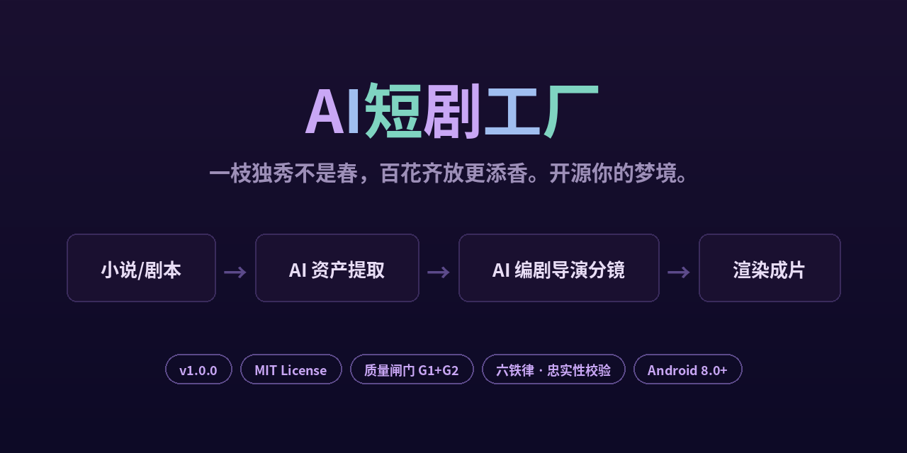
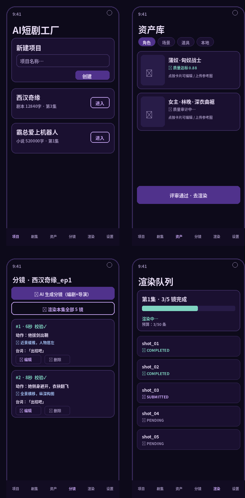

# AI短剧工厂

   

> **v1.4.0** — 双模式生产版：首页🤖AI全托管 / ✍️人工模式双入口；粘文本一键成片 + 实时五阶段进度流；成片库一键端上 ffmpeg 合成 + 分享。

<p align="center"></p>

## 📱 应用截图

<p align="center">
  
</p>
<p align="center"><sub>项目列表 · 资产库（质量评分） · AI 分镜（编辑/删除/一键渲染） · 渲染队列</sub></p>

## ✨ 核心特性

| 模块 | 说明 |
|---|---|
| 🤖 **AI 全托管模式** | 首页一键切换「🤖 AI 全托管」：粘文本自动建项目 → 五阶段流水线（提取资产→生成图像→质量审计→生成分镜→入队渲染）→ 实时进度流，支持任意注册推理模型（DeepSeek/Agnes/商汤…）作大脑 |
| ✍️ **人工模式** | 传统项目/剧集/资产/分镜手动流程，精细可控 |
| 📚 **项目 / 剧集管理** | 多项目多剧集，每集独立持有剧本、资产、分镜与渲染记录 |
| 🤖 **AI 资产提取** | 大模型从小说/剧本自动提取角色、场景、道具清单，规则引擎兜底 |
| 🎨 **资产生成与编辑** | 文生图 / 图生图；点卡片即可编辑描述、上传参考图、删除、停止生成 |
| 👤 **角色 DNA 6 姿态** | 正面锚点 / 45° 侧脸 / 全身骑乘 / 三种情绪特写，跨镜形象锁定 |
| 🛡 **QualityEngine 质量闸门** | G1 文件级硬校验 + G2 多模态质检打分，缺陷直接拒 |
| 🎬 **AI 编剧 + 导演** | 剧本一键拆解镜头表，逐镜生成运镜视觉指令；分镜可编辑可删 |
| ⚖️ **六铁律 + 忠实性闸门** | 台词逐字校验、资产真实绑定、时间逆转词表拦截 |
| 🏛 **时代红线自动推断** | AI 判断剧本朝代（汉/唐/宋/明/清/民国/现代/架空），约束随剧适配；禁词走 negative_prompt 正负分离，支持按剧集放行 |
| 🎞 **成片库 + 端上合成** | 每集渲染完成后可一键调用端上 ffmpeg-kit 合成整集 mp4，落 Room 成片库，支持分享导出 |
| ▶️ **渲染队列** | 断点续传、预算熔断、防重复扣费（checkpoint 语义），一键渲染整集 |
| 🔊 **中文配音指令** | 台词前置主导生成 prompt，成片默认中文普通话配音 |
| 🧠 **文本模型路由** | 设置页可分别配置 Agnes / DeepSeek 的 API Key 与默认模型，互不干扰，AI 模式可指定任一作编排大脑 |

## 🔄 工作流

```
首页双模式入口
  ├── 🤖 AI 全托管：粘文本 → 自动建项目 → 五阶段流水线（实时进度流）→ 分镜 → 成片库合成
  └── ✍️ 人工模式：项目 → 剧集 → 导入剧本
                                     │
                                     ▼
                           ┌─ AI 提取资产（角色/场景/道具）
                           │         │
                           │         ▼
                           │   图像生成 ⇄ 编辑/参考图/6姿态
                           │         │
                           │         ▼
                           └─ AI 分镜（编剧拆镜 + 导演视觉指令）
                                     │  ← 六铁律 + 忠实性校验
                                     ▼
                               一键渲染整集 ──► 渲染队列（断点续传/预算熔断）──► 成片库（端上 ffmpeg 合成）
```

## 🏗 架构

```
app/           Android 壳：Compose UI · Room 持久化 · Foreground Service · 首页双模式 · 成片库
core-engine/   纯 Kotlin 引擎：Provider 适配 · 质量闸门 · AI 编排器 · 渲染队列 · 成片合成
```

`core-engine` 不依赖 Android，可直接用于 JVM 服务端部署（Ktor 上云路径已预留）。

## 📲 安装

从 [Releases](https://github.com/owlco001/ai-drama-factory/releases) 下载最新 APK 直接安装（Android 8.0+）。

## 🔨 构建

```bash
./gradlew :app:assembleDebug
```

要求：JDK 17+，Android SDK 34。

使用前在「设置」页配置 Agnes API Key（[apihub.agnes-ai.com](https://apihub.agnes-ai.com)），
支持文本 / 图像 / 视频三通道与模型自动选择（按输入规模自动路由 512K/256K 上下文窗口）。
AI 全托管模式可在「文本模型」设置项下配置 DeepSeek 等第三方推理 Key。

## 🗺 路线图

- [ ] C 端云服务（Ktor 后端 + 多用户账号体系）
- [ ] 角色生成无干扰纯色背景模式
- [x] ~~时代红线按剧本自动推断~~（v1.1.0 已完成）
- [x] ~~成片库导出分享 / 端上合成~~（v1.4.0 已完成）
- [x] ~~首页双模式 + AI 全托管流水线~~（v1.4.0 已完成）

## 🤝 贡献

欢迎 Issue 与 PR。提交前请确保 `./gradlew test` 全绿。

## License

[MIT](LICENSE) — 使用本项目生成的内容版权归内容创作者所有，请遵守目标平台内容规范与相关法律法规。
